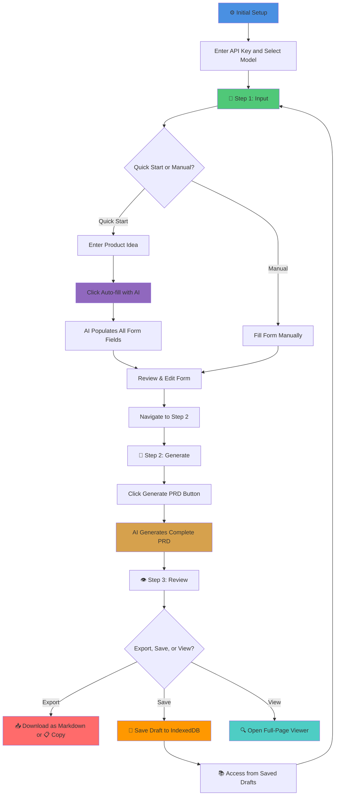

# 📝 AI PRD Creator

[](https://prd.aineedjob.com)
[](https://nextjs.org/)
[](https://www.typescriptlang.org/)
[](https://tailwindcss.com/)
[](http://buymeacoffee.com/aungmyokyaw)

An intelligent Product Requirements Document (PRD) generator powered by Google's Gemini AI. Transform your product ideas into comprehensive, professional PRDs in minutes with a beautiful Compact Neo-Brutalism design that features refined borders, optimized shadows, and efficient layouts.

🌐 **Live Demo**: [https://prd.aineedjob.com](https://prd.aineedjob.com)

**Language**: English | [简体中文](README_zh.md)

## ✨ Features

### 🎯 Core Functionality

- **🌍 Chinese/English Bilingual UI**: Instant language switching with toggle button (中/EN), persistent language preference
- **🧙‍♂️ 3-Step Wizard Flow**: Guided wizard interface (Input → Generate → Review) for streamlined PRD creation
- **🚀 Quick Start with AI**: Describe your product idea in plain text and let AI auto-fill the entire form
- **📋 Structured Form Input**: Organized sections for all essential PRD components (9 sections including tech stack and constraints)
- **🤖 AI-Powered Generation**: Generate complete, professional PRDs using Gemini AI (40+ models available)
- **🔍 Full-Page PRD Viewer**: Dedicated full-screen viewer with enhanced readability and navigation
- **📥 Multiple Export Options**: Download as Markdown or copy to clipboard with smart naming (productname_prd_date.md)
- **💾 Advanced Draft Management**: Save and manage up to 12 PRD drafts with IndexedDB, localStorage fallback, and migration support
- **🔄 Draft Loading**: Load saved drafts with automatic state restoration and context preservation
- **📱 Enhanced PWA**: Full Progressive Web App support with install prompts and offline capabilities

### 🌐 Internationalization

- **🌍 Chinese/English Bilingual**: Full bilingual support with instant language switching between Chinese (简体中文) and English
- **🎯 AI Language-Aware Generation**: PRD content generated in Chinese when Chinese UI is selected, English when English UI is selected
- **💾 Persistent Language Preference**: Language choice saved automatically, restored on next visit
- **🔤 SEO Multi-Language Support**: Page metadata and social sharing tags adapt to selected language

### 🎨 Design & UX

- **🎨 Compact Neo-Brutalism Design**: Updated 2025 design system with refined borders (2px standard, 3px emphasis) and optimized spacing
- **🌞 High-Contrast Interface**: Clean, accessible design with vibrant accent colors (yellow #FFEB3B, blue #2196F3, pink #E91E63)
- **📱 Fully Responsive**: Optimized for desktop, tablet, and mobile with improved content density
- **📲 Enhanced PWA Support**: Install as a native app with smart install prompts and dismissal tracking
- **⚡ Smooth Animations**: Fluid transitions (150-250ms) and interactive hover states with reduced motion support
- **🎯 Advanced Model Indicator**: Always know which AI model you're using with display names and descriptions

### 🤖 AI Capabilities

- **🌐 Language-Aware Generation**: AI generates PRD content in Chinese when Chinese UI is selected, English when English UI is selected
- **🔄 Dynamic Model Selection**: Choose from 40+ Gemini models
- **📡 Live Model Fetching**: Auto-updates with latest models from Google
- **🎛️ Flexible Configuration**: Customize API key and model preferences
- **⏰ Contextual Prompts**: All prompts include current date/time
- **🎯 Smart Defaults**: Pre-configured with Gemini 2.5 Flash
- **💾 Fallback Models**: Works offline with 13 cached models

## 🛠️ Tech Stack

- **Framework**: [Next.js 15.5.4](https://nextjs.org/) with App Router
- **Language**: [TypeScript 5.9.2](https://www.typescriptlang.org/)
- **Styling**: [Tailwind CSS 4.1.14](https://tailwindcss.com/) with Compact Neo-Brutalism design system
- **i18n**: [next-intl](https://next-intl-docs.vercel.app/) for Chinese/English bilingual support
- **AI**: [Google Gemini API](https://ai.google.dev/) (@google/genai v1.21.0)
- **UI Components**: [Radix UI](https://www.radix-ui.com/) primitives for accessibility (Dialog, Scroll Area, Tabs, Tooltip)
- **Storage**: IndexedDB with idb library v8.0.3 for saved drafts (12-draft limit with auto-migration)
- **Icons**: [Lucide React](https://lucide.dev/) v0.544.0 + [Radix Icons](https://www.radix-ui.com/icons) v1.3.1
- **Markdown**: react-markdown v10.1.0 with remark-gfm v4.0.0 for GFM support
- **PWA**: next-pwa v5.6.0 for Progressive Web App support with service worker caching
- **Document Export**: jsPDF v3.0.3 and docx v9.2.2 (integrated)

## 🚀 Quick Start

### Option 1: Use the Live Demo (Recommended)

No installation needed! Just visit [https://prd.aineedjob.com](https://prd.aineedjob.com) and:

1. Click the ⚙️ settings icon
2. Enter your Gemini API key ([Get one here](https://aistudio.google.com/apikey))
3. Choose your preferred model (default: Gemini 2.5 Flash)
4. Start creating PRDs!

### Option 2: Local Development

1. **Clone the repository**

   ```bash
   git clone https://github.com/yourusername/prd-creator.git
   cd prd-creator
   ```

2. **Install dependencies**

   ```bash
   npm install
   ```

3. **Run the development server**

   ```bash
   npm run dev
   ```

4. **Open your browser**

   Navigate to [http://localhost:3000](http://localhost:3000)

> **Note**: The app stores your API key locally in your browser. It's never sent to any server except Google's Gemini API.

## 🔑 Getting Your Gemini API Key

1. Visit [Google AI Studio](https://aistudio.google.com/apikey)
2. Sign in with your Google account
3. Click "Get API Key" or "Create API Key"
4. Copy the key and paste it in the settings modal
5. Your key is stored locally in your browser's localStorage

**Privacy**: Your API key never leaves your browser except to call Google's Gemini API directly.

## 🎯 How It Works



## 📱 Progressive Web App (PWA)

AI PRD Creator is a fully installable Progressive Web App!

### Installation

**Desktop (Chrome, Edge, Brave):**

1. Click the install icon (⊕) in the address bar
2. Or click "Install" button in settings
3. App opens in its own window

**Mobile (iOS Safari):**

1. Tap the Share button
2. Select "Add to Home Screen"
3. App appears like a native app

**Mobile (Android Chrome):**

1. Tap the three-dot menu
2. Select "Install App" or "Add to Home Screen"
3. Launch from your home screen

### PWA Features

- ✅ Works offline (cached models)
- ✅ Fast loading with service workers
- ✅ Native app experience
- ✅ No app store needed
- ✅ Auto-updates on launch

## 🎨 Compact Neo-Brutalism Design System (2025 Update)

Inspired by Brutalist design principles, optimized for modern interfaces:

- **Refined Borders**: Compact 2px black borders (3px for emphasis) for efficient visual hierarchy
- **Optimized Shadows**: Refined offset shadows (2px 2px 0px standard, 4px 4px 0px emphasis) for depth
- **High-Contrast Colors**: Vibrant palette with primary yellow (#FFEB3B), secondary blue (#2196F3), accent pink (#E91E63)
- **Interactive Elements**: Pressable buttons with smooth transform animations (150-250ms)
- **Typography**: Big Shoulders Display for headings, Inter for body text with optimized sizing
- **Responsive Design**: Improved content density and mobile experience with compact layout
- **Accessibility**: WCAG 2.1 Level AA compliant with 4.5:1 contrast ratios

## 🤖 AI Model Selection

### Dynamic Model Fetching

The app automatically fetches the latest available models from Google's Gemini API:

- 40+ models available
- Real-time updates
- Model descriptions and specs
- Input/output token limits

### Model Categories (Auto-sorted)

1. **Gemini 2.5 Flash** - Lightning fast, 1M context (default)
2. **Gemini 2.5 Pro** - Most capable, advanced reasoning
3. **Gemini 2.0 Flash** - Previous generation, stable
4. **Gemini 2.0 Pro** - Previous gen, high quality
5. **Specialized Models** - Embedding, thinking, etc.

### Fallback Models

If API fetch fails, the app uses 13 cached models:

- Gemini 2.5 Flash (stable)
- Gemini 2.5 Pro (stable)
- Gemini 2.0 Flash variants
- All essential models for PRD generation

### Model Display

- 🟢 **Visual Indicator**: Always shows current model in header
- **Display Names**: Official model names from Google
- **Descriptions**: Detailed info for each model
- **Smart Defaults**: Pre-configured with best model

## 🏗️ Architecture

### Project Structure

```
prd-creator/
├── src/
│   ├── app/
│   │   ├── api/
│   │   │   ├── _lib/
│   │   │   │   ├── datetime.ts          # Date/time context helper
│   │   │   │   └── gemini-client.ts     # Gemini API client
│   │   │   ├── generate/route.ts        # PRD generation endpoint
│   │   │   ├── models/route.ts          # Model fetching endpoint
│   │   │   ├── prefill/route.ts         # Form auto-fill endpoint
│   │   │   └── refine/route.ts          # Section refinement endpoint
│   │   ├── layout.tsx                   # Root layout with PWA config
│   │   ├── page.tsx                     # Main application page
│   │   └── globals.css                  # Global styles
│   ├── components/
│   │   ├── button.tsx                   # Reusable button component
│   │   ├── language-switcher.tsx        # Chinese/English language toggle
│   │   ├── footer.tsx                   # App footer with copyright
│   │   ├── full-page-prd-viewer.tsx     # Full-screen PRD viewer
│   │   ├── header.tsx                   # Header with settings/drafts
│   │   ├── input-field.tsx              # Text input component
│   │   ├── loader.tsx                   # Loading spinner
│   │   ├── markdown-renderer.tsx        # Markdown display
│   │   ├── prd-display.tsx              # PRD viewer with export
│   │   ├── prd-form.tsx                 # Main form component
│   │   ├── prd-wizard.tsx               # 3-step wizard wrapper
│   │   ├── pwa-install-prompt.tsx       # PWA install button
│   │   ├── refine-modal.tsx             # Section refinement dialog
│   │   ├── saved-drafts-modal.tsx       # Draft management interface
│   │   ├── section.tsx                  # Form section wrapper
│   │   ├── settings-modal.tsx           # API key & model settings
│   │   └── textarea-field.tsx           # Multi-line input
│   ├── i18n/
│   │   ├── config.ts                    # i18n configuration (locales)
│   │   ├── language-provider.tsx        # React context for language state
│   │   └── use-document-metadata.ts     # SEO metadata hook
│   ├── locales/
│   │   ├── en.json                      # English translations
│   │   └── zh.json                      # Chinese translations
│   ├── lib/
│   │   ├── api-messages.ts              # Localized API error messages
│   │   ├── drafts.ts                    # IndexedDB draft management
│   │   ├── download.ts                  # File download utilities
│   │   ├── ingest.ts                    # Data ingestion helpers
│   │   ├── models.ts                    # Gemini model definitions
│   │   ├── prd.ts                       # PRD type definitions
│   │   └── prompt.ts                    # AI prompt templates
│   └── types/
│       └── next-pwa.d.ts                # PWA type definitions
├── public/
│   ├── icon-*.png                       # PWA icons (192, 384, 512)
│   ├── apple-touch-icon*.png            # Apple device icons
│   ├── favicon*.{ico,png}               # Favicons
│   ├── manifest.json                    # PWA manifest
│   └── *.svg                           # Static SVG assets
├── specs/                               # Project documentation
│   ├── PBI.md                          # Product Backlog Items
│   ├── PRD.md                          # Project PRD
│   ├── README.md                       # Specs documentation
│   ├── SDD.md                          # Software Design Document
│   ├── SRS.md                          # Software Requirements
│   └── UI-UX-DESIGN-GUIDELINES.md      # Design guidelines
├── .editorconfig                        # Editor configuration
├── .prettierignore                      # Prettier ignore rules
├── .prettierrc                          # Prettier config
├── eslint.config.mjs                    # ESLint configuration
├── next.config.mjs                      # Next.js + PWA config
├── package.json                         # Dependencies
├── postcss.config.mjs                   # PostCSS config
└── tsconfig.json                        # TypeScript config
```

### API Routes

#### POST `/api/models`

Fetches available Gemini models from Google API.

**Request:**

```typescript
{
  apiKey: string;
}
```

**Response:**

```json
{
  "models": [
    {
      "value": "gemini-2.5-flash",
      "label": "Gemini 2.5 Flash",
      "displayName": "Gemini 2.5 Flash",
      "description": "Fast and efficient...",
      "inputTokenLimit": 1048576,
      "outputTokenLimit": 65536
    }
  ]
}
```

#### POST `/api/prefill`

Auto-fills form from a product idea description.

**Request:**

```typescript
{
  apiKey: string,
  model: string,
  productIdea: string,
  locale?: 'zh' | 'en'  // Optional: language preference
}
```

**Response:**

```json
{
  "data": {
    "productName": "FitFinder",
    "targetAudience": "Health-conscious millennials...",
    "problemStatement": "...",
    "proposedSolution": "...",
    "coreFeatures": "...",
    "businessGoals": "...",
    "futureFeatures": "...",
    "techStack": "...",
    "constraints": "..."
  }
}
```

#### POST `/api/generate`

Generates a complete PRD from structured inputs.

**Request:**

```typescript
{
  apiKey: string,
  model: string,
  locale?: 'zh' | 'en',  // Optional: language preference
  inputs: {
    productName: string,
    targetAudience: string,
    problemStatement: string,
    proposedSolution: string,
    coreFeatures: string,
    businessGoals: string,
    successMetrics: string,
    futureFeatures: string,
    techStack: string,
    constraints: string,
    dependencies: string
  }
}
```

**Response:**

```json
{
  "data": "# FitFinder\n\n## 1. Introduction & Vision\n\n..."
}
```

#### POST `/api/refine`

Refines a specific section based on user feedback.

**Request:**

```typescript
{
  apiKey: string,
  model: string,
  currentInputs: { /* current form state */ },
  sectionTitle: string,
  userFeedback: string
}
```

**Response:**

```json
{
  "data": {
    "productName": "...",
    "problemStatement": "...",
    "proposedSolution": "..."
  }
}
```

### Date/Time Context

All AI prompts automatically include:

```typescript
Current Date: January 21, 2025
Current Time: 3:45 PM PST
```

This ensures:

- Time-relevant recommendations
- Current technology suggestions
- Accurate market context

## 💡 Example Use Case

**Product Idea**: "A mobile app for finding and booking local fitness classes"

### Quick Start Flow:

1. Click ⚙️ settings, enter your Gemini API key
2. **Step 1: Input** - Enter the idea: "A mobile app for finding local fitness classes"
3. Click "Auto-fill Form with AI ✨"
4. AI generates:
   ```
   Product Name: FitFinder
   Target Audience: Health-conscious millennials aged 25-40...
   Problem Statement: People struggle to discover local fitness classes...
   Proposed Solution: A mobile app that aggregates...
   Core Features:
   - Interactive map view of nearby classes
   - Real-time availability
   - In-app booking
   - User reviews and ratings
   ...
   ```
5. Review and adjust as needed
6. **Step 2: Generate** - Click "Generate PRD" → Get a comprehensive PRD!
7. **Step 3: Review** - View PRD in full-page viewer or export
8. 📥 Download as `fitfinder_prd_2025-01-21.md` or 💾 save as draft

## 🚀 Building for Production

```bash
# Install dependencies
npm install

# Build the application
npm run build

# Start production server
npm start

# Or deploy to Vercel with one click
vercel deploy
```

## 🧪 Development

```bash
# Run development server with Turbopack
npm run dev

# Run linting
npm run lint

# Build for production
npm run build
```

## 🌟 Key Features Explained

### 1. 🧙‍♂️ Wizard-Based Interface

A streamlined 3-step workflow that guides users through PRD creation:

- **Step 1: Input** - Form with quick-start AI prefill or manual entry
- **Step 2: Generate** - One-click PRD generation with Gemini AI
- **Step 3: Review** - Full-screen viewer with export and save options
- **Progress indicators** for clear navigation
- **Persistent state** across steps with draft auto-save

### 2. 💾 Advanced Draft Management

- **IndexedDB storage** with idb library for persistent draft saving
- **Auto-migration** from localStorage to IndexedDB with error handling
- **12-draft limit** with automatic cleanup and storage management
- **One-click loading** of previous work with full state restoration
- **Delete functionality** with confirmation dialogs
- **Metadata storage** including creation date, model used, and content preview

### 3. 🤖 Smart AI Integration

- **Dynamic model selection** from 40+ Gemini models
- **Contextual prompts** with date/time information
- **Structured JSON responses** for consistency
- **Auto-fill feature** for rapid form completion
- **Fallback models** for offline reliability

### 4. 📱 PWA Capabilities

- **Installable** on any device (desktop, iOS, Android)
- **Offline support** with service workers
- **Fast loading** with Workbox caching
- **Native app feel** in standalone mode
- **Auto-updates** on app launch
- **Smart install prompts** with dismissal tracking

### 5. 📥 Export Options

- **Markdown download** with smart file naming (productname_prd_YYYY-MM-DD.md)
- **One-click copy** to clipboard with plain text formatting
- **Timestamped filenames** for version control
- **Clean markdown format** compatible with GitHub, GitLab, Notion, etc.

### 6. 🔒 Privacy First

- **Client-side API key storage** (localStorage only)
- **No server-side key storage** or logging
- **Direct API calls** to Google Gemini only
- **No tracking or analytics** or user data collection
- **Open source** for full transparency
- **Browser-only storage** with user control over data deletion

## 🎨 Neo-Brutalism Design System

### Color Palette

```css
/* Primary Colors */
--primary-blue: #2196f3 /* Material Blue */ --success-green: #4caf50
  /* Material Green */ --warning-yellow: #ffeb3b /* Material Yellow */
  --error-red: #f44336 /* Material Red */ --neutral-white: #ffffff
  /* Pure White */ --neutral-gray: #f5f5f5 /* Light Gray */
  /* Design Elements */ --border-black: #000000 /* Black borders */
  --shadow-black: rgba(0, 0, 0, 1) /* Black shadows */;
```

### Design Patterns

```css
/* Neo-Brutalist Button */
border: 3px solid var(--border-black);
box-shadow: 4px 4px 0px var(--shadow-black);
transition: all 150ms ease;

/* Hover State */
box-shadow: 6px 6px 0px var(--shadow-black);
transform: translate(-2px, -2px);

/* Active State */
box-shadow: 2px 2px 0px var(--shadow-black);
transform: translate(2px, 2px);
```

## 📊 Component Architecture

### State Management

```typescript
// Main application state
const [apiKey, setApiKey] = useState<string>('');
const [selectedModel, setSelectedModel] = useState<string>('gemini-2.5-flash');
const [modelDisplayName, setModelDisplayName] =
  useState<string>('Gemini 2.5 Flash');
const [productIdea, setProductIdea] = useState<string>('');
const [formInputs, setFormInputs] = useState<FormInputs>({});
const [generatedPRD, setGeneratedPRD] = useState<string>('');
const [isGenerating, setIsGenerating] = useState<boolean>(false);
```

### Data Flow

```
User Input → Form State → API Call → Gemini AI → Response → Display
     ↓                         ↓                      ↓
localStorage            Date/Time Context      Markdown Render
                        Model Selection         Copy/Download
```

## 🔧 Configuration

### No Environment Variables Required!

The app uses **client-side configuration only**:

- API keys stored in browser localStorage
- Model preferences saved locally
- No `.env` file needed
- No server-side secrets

### Optional Server Deployment Variables

If you want to provide a default API key (not recommended):

```bash
# .env.local (optional, not recommended)
NEXT_PUBLIC_GEMINI_API_KEY=your_key_here
```

## 📱 PWA Installation Guide

### Desktop

1. Visit [https://prd.aineedjob.com](https://prd.aineedjob.com)
2. Look for install icon in address bar (⊕)
3. Click "Install" or use settings button
4. App opens in standalone window

### iOS (Safari)

1. Open in Safari browser
2. Tap Share button (square with arrow)
3. Scroll down, tap "Add to Home Screen"
4. Tap "Add" in top right
5. App icon appears on home screen

### Android (Chrome)

1. Open in Chrome browser
2. Tap three-dot menu
3. Tap "Install app" or "Add to Home Screen"
4. Confirm installation
5. Launch from home screen or app drawer

## 🤝 Contributing

Contributions are welcome! Here's how:

1. Fork the repository
2. Create a feature branch (`git checkout -b feature/amazing-feature`)
3. Make your changes
4. Test thoroughly (`npm run dev`)
5. Commit your changes (`git commit -m 'Add amazing feature'`)
6. Push to the branch (`git push origin feature/amazing-feature`)
7. Open a Pull Request

### Development Guidelines

- Follow existing code style
- Add TypeScript types for all new code
- Test on desktop and mobile
- Ensure PWA functionality works
- Update documentation if needed

## 📄 License

This project is licensed under the MIT License - see the LICENSE file for details.

## 🙏 Acknowledgments

- **AI**: Powered by [Google Gemini AI](https://ai.google.dev/)
- **i18n**: [next-intl](https://next-intl-docs.vercel.app/) for bilingual support
- **Framework**: Built with [Next.js](https://nextjs.org/) 15.5.4 and React 19
- **UI Components**: [Radix UI](https://www.radix-ui.com/) primitives
- **Styling**: [Tailwind CSS](https://tailwindcss.com/) v4 with Compact Neo-Brutalism
- **Icons**: [Lucide React](https://lucide.dev/) + [Radix Icons](https://www.radix-ui.com/icons)
- **Markdown**: [react-markdown](https://github.com/remarkjs/react-markdown) with GFM support
- **PWA**: [next-pwa](https://github.com/shadowwalker/next-pwa) for Progressive Web App
- **Storage**: [idb](https://github.com/jakearchibald/idb) for IndexedDB management

## 🌐 Live Demo

**Visit**: [https://prd.aineedjob.com](https://prd.aineedjob.com)

**Features to Try:**

1. 🌍 Switch between Chinese (中文) and English using the language toggle
2. ⚙️ Configure your API key (free from Google AI Studio)
3. 🧙‍♂️ Follow the 3-step wizard (Input → Generate → Review)
3. 🚀 Use Quick Start to auto-fill a form
4. 🤖 Generate comprehensive PRD with AI
5. 🔍 View PRD in full-page viewer
6. 💾 Save drafts to browser storage with IndexedDB
7. 📚 Manage and load saved drafts
8. 📥 Download PRD as Markdown or copy to clipboard
9. 📱 Install as PWA on your device

---

**Made with ❤️ using Gemini AI**

[](https://vercel.com/new/clone?repository-url=https://github.com/yourusername/prd-creator)
