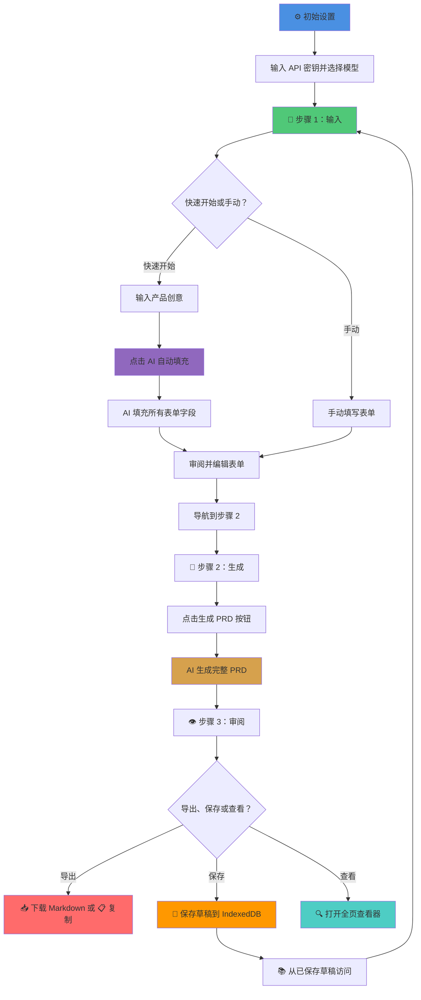

# 📝 AI PRD 生成器

[](https://prd.aineedjob.com)
[](https://nextjs.org/)
[](https://www.typescriptlang.org/)
[](https://tailwindcss.com/)
[](http://buymeacoffee.com/aungmyokyaw)

一款由 Google Gemini AI 驱动的智能产品需求文档（PRD）生成器。只需几分钟即可将您的产品创意转化为全面、专业的 PRD，采用精致的新野兽派设计风格，具有优化的边框、阴影和高效布局。

🌐 **在线演示**: [https://prd.aineedjob.com](https://prd.aineedjob.com)

**语言**: [English](README.md) | 简体中文

## ✨ 功能特性

### 🎯 核心功能

- **🧙‍♂️ 三步向导流程**: 引导式向导界面（输入 → 生成 → 审阅），简化 PRD 创建流程
- **🚀 AI 快速开始**: 用纯文本描述产品创意，让 AI 自动填充整个表单
- **📋 结构化表单输入**: 为所有核心 PRD 组件提供有序分区（9 个部分，包括技术栈和约束条件）
- **🤖 AI 驱动生成**: 使用 Gemini AI 生成完整的 PRD（40+ 模型可选）
- **🔍 全页 PRD 预览**: 专用全屏查看器，增强可读性和导航体验
- **📥 多种导出选项**: 下载为 Markdown 或复制到剪贴板，智能命名（productname_prd_date.md）
- **💾 高级草稿管理**: 使用 IndexedDB 保存和管理多达 12 个 PRD 草稿，支持 localStorage 回退和自动迁移
- **🔄 草稿加载**: 加载已保存的草稿，自动恢复状态和上下文
- **📱 增强 PWA**: 完整的渐进式 Web 应用支持，提供安装提示和离线功能

### 🌐 国际化

- **🌍 中英双语支持**: 完整的双语支持，可在中文（简体中文）和英文之间即时切换
- **🎯 AI 语言感知生成**: 选择中文 UI 时生成中文 PRD 内容，选择英文 UI 时生成英文内容
- **💾 持久化语言偏好**: 自动保存语言选择，下次访问时恢复
- **🔤 SEO 多语言支持**: 页面元数据和社交分享标签根据所选语言自适应

### 🎨 设计与体验

- **🎨 精致新野兽派设计**: 2025 更新的设计系统，优化的边框（标准 2px，强调 3px）和间距
- **🌞 高对比度界面**: 清晰、可访问的设计，充满活力的强调色（黄色 #FFEB3B、蓝色 #2196F3、粉色 #E91E63）
- **📱 完全响应式**: 针对桌面、平板和移动设备优化，改进内容密度
- **📲 增强 PWA 支持**: 安装为原生应用，智能安装提示和关闭跟踪
- **⚡ 流畅动画**: 流畅的过渡效果（150-250ms）和交互式悬停状态，支持减少动画
- **🎯 高级模型指示器**: 始终知道正在使用的 AI 模型，显示名称和描述

### 🤖 AI 能力

- **🌐 语言感知生成**: AI 根据所选 UI 语言生成对应语言的 PRD 内容（中文界面→中文，英文界面→英文）
- **🔄 动态模型选择**: 从 40+ Gemini 模型中选择
- **📡 实时模型获取**: 自动更新 Google 最新模型
- **🎛️ 灵活配置**: 自定义 API 密钥和模型偏好
- **⏰ 上下文提示**: 所有提示包含当前日期/时间
- **🎯 智能默认**: 预配置 Gemini 2.5 Flash
- **💾 回退模型**: 离线时使用 13 个缓存模型

## 🛠️ 技术栈

- **框架**: [Next.js 15.5.4](https://nextjs.org/) App Router
- **语言**: [TypeScript 5.9.2](https://www.typescriptlang.org/)
- **样式**: [Tailwind CSS 4.1.14](https://tailwindcss.com/) 精致新野兽派设计系统
- **国际化**: [next-intl](https://next-intl-docs.vercel.app/) 中英双语支持
- **AI**: [Google Gemini API](https://ai.google.dev/) (@google/genai v1.21.0)
- **UI 组件**: [Radix UI](https://www.radix-ui.com/) 基础组件，无障碍访问
- **存储**: IndexedDB + idb v8.0.3 管理草稿（12 个草稿限制，自动迁移）
- **图标**: [Lucide React](https://lucide.dev/) v0.544.0 + [Radix Icons](https://www.radix-ui.com/icons) v1.3.1
- **Markdown**: react-markdown v10.1.0 + remark-gfm v4.0.0 GFM 支持
- **PWA**: next-pwa v5.6.0 渐进式 Web 应用，Service Worker 缓存
- **文档导出**: jsPDF v3.0.3 和 docx v9.2.2（已集成）

## 🚀 快速开始

### 方式一：使用在线演示（推荐）

无需安装！直接访问 [https://prd.aineedjob.com](https://prd.aineedjob.com) 即可：

1. 点击 ⚙️ 设置图标
2. 输入您的 Gemini API 密钥（[点击这里获取](https://aistudio.google.com/apikey)）
3. 选择您偏好的模型（默认：Gemini 2.5 Flash）
4. 开始创建 PRD！

### 方式二：本地开发

1. **克隆仓库**

   ```bash
   git clone https://github.com/yourusername/prd-creator.git
   cd prd-creator
   ```

2. **安装依赖**

   ```bash
   npm install
   ```

3. **运行开发服务器**

   ```bash
   npm run dev
   ```

4. **打开浏览器**

   访问 [http://localhost:3000](http://localhost:3000)

> **注意**: 应用将您的 API 密钥存储在本地浏览器中。除了调用 Google 的 Gemini API 外，不会发送到任何其他服务器。

## 🔑 获取 Gemini API 密钥

1. 访问 [Google AI Studio](https://aistudio.google.com/apikey)
2. 使用 Google 账号登录
3. 点击"获取 API 密钥"或"创建 API 密钥"
4. 复制密钥并粘贴到设置对话框中
5. 密钥将存储在浏览器 localStorage 中

**隐私保护**: 您的 API 密钥永远不会离开浏览器，只会直接调用 Google 的 Gemini API。

## 🎯 工作原理



## 📱 渐进式 Web 应用（PWA）

AI PRD 生成器是完全可安装的渐进式 Web 应用！

### 安装方法

**桌面端（Chrome、Edge、Brave）：**

1. 点击地址栏中的安装图标（⊕）
2. 或点击设置中的"安装"按钮
3. 应用在独立窗口中打开

**移动端（iOS Safari）：**

1. 点击分享按钮
2. 选择"添加到主屏幕"
3. 应用像原生应用一样显示

**移动端（Android Chrome）：**

1. 点击三点菜单
2. 选择"安装应用"或"添加到主屏幕"
3. 从主屏幕或应用抽屉启动

### PWA 功能

- ✅ 离线工作（缓存模型）
- ✅ Service Worker 快速加载
- ✅ 原生应用体验
- ✅ 无需应用商店
- ✅ 启动时自动更新

## 🎨 精致新野兽派设计系统（2025 更新）

受野兽派设计原则启发，为现代界面优化：

- **精致边框**: 紧凑的 2px 黑色边框（强调时 3px），高效的视觉层级
- **优化阴影**: 精细的偏移阴影（标准 2px 2px 0px，强调 4px 4px 0px）
- **高对比度配色**: 充满活力的调色板，主黄色（#FFEB3B）、次蓝色（#2196F3）、强调粉色（#E91E63）
- **交互元素**: 可按压按钮，流畅的变换动画（150-250ms）
- **排版**: Big Shoulders Display 标题，Inter 正文，优化尺寸
- **响应式设计**: 改进的内容密度和移动体验，紧凑布局
- **无障碍访问**: WCAG 2.1 AA 级合规，4.5:1 对比度

## 🤖 AI 模型选择

### 动态模型获取

应用自动从 Google Gemini API 获取最新可用模型：

- 40+ 模型可用
- 实时更新
- 模型描述和规格
- 输入/输出 token 限制

### 模型分类（自动排序）

1. **Gemini 2.5 Flash** - 极速，1M 上下文（默认）
2. **Gemini 2.5 Pro** - 最强能力，高级推理
3. **Gemini 2.0 Flash** - 上一代，稳定
4. **Gemini 2.0 Pro** - 上一代，高质量
5. **专用模型** - 嵌入、思考等

### 回退模型

如果 API 获取失败，应用使用 13 个缓存模型：

- Gemini 2.5 Flash（稳定）
- Gemini 2.5 Pro（稳定）
- Gemini 2.0 Flash 变体
- PRD 生成的所有基本模型

### 模型显示

- 🟢 **视觉指示器**: 始终在标题中显示当前模型
- **显示名称**: Google 官方模型名称
- **描述**: 每个模型的详细信息
- **智能默认**: 预配置最佳模型

## 🏗️ 架构

### 项目结构

```
prd-creator/
├── src/
│   ├── app/
│   │   ├── api/
│   │   │   ├── _lib/
│   │   │   │   ├── datetime.ts          # 日期/时间上下文助手
│   │   │   │   └── gemini-client.ts     # Gemini API 客户端
│   │   │   ├── generate/route.ts        # PRD 生成端点
│   │   │   ├── models/route.ts          # 模型获取端点
│   │   │   ├── prefill/route.ts         # 表单自动填充端点
│   │   │   └── refine/route.ts          # 章节精炼端点
│   │   ├── layout.tsx                   # 根布局，PWA 配置
│   │   ├── page.tsx                     # 主应用页面
│   │   └── globals.css                  # 全局样式
│   ├── components/
│   │   ├── button.tsx                   # 可复用按钮组件
│   │   ├── language-switcher.tsx        # 中英文语言切换
│   │   ├── footer.tsx                   # 应用页脚，版权信息
│   │   ├── full-page-prd-viewer.tsx     # 全屏 PRD 查看器
│   │   ├── header.tsx                   # 标题栏，设置/草稿
│   │   ├── input-field.tsx              # 文本输入组件
│   │   ├── loader.tsx                   # 加载动画
│   │   ├── markdown-renderer.tsx        # Markdown 显示
│   │   ├── prd-display.tsx              # PRD 查看器，导出功能
│   │   ├── prd-form.tsx                 # 主表单组件
│   │   ├── prd-wizard.tsx               # 三步向导包装器
│   │   ├── pwa-install-prompt.tsx       # PWA 安装按钮
│   │   ├── refine-modal.tsx             # 章节精炼对话框
│   │   ├── saved-drafts-modal.tsx       # 草稿管理界面
│   │   ├── section.tsx                  # 表单章节包装器
│   │   ├── settings-modal.tsx           # API 密钥和模型设置
│   │   └── textarea-field.tsx           # 多行输入
│   ├── i18n/
│   │   ├── config.ts                    # i18n 配置（语言）
│   │   ├── language-provider.tsx        # 语言状态 React 上下文
│   │   └── use-document-metadata.ts     # SEO 元数据 Hook
│   ├── locales/
│   │   ├── en.json                      # 英文翻译
│   │   └── zh.json                      # 中文翻译
│   ├── lib/
│   │   ├── api-messages.ts              # 本地化 API 错误消息
│   │   ├── drafts.ts                    # IndexedDB 草稿管理
│   │   ├── download.ts                  # 文件下载工具
│   │   ├── ingest.ts                    # 数据摄取助手
│   │   ├── models.ts                    # Gemini 模型定义
│   │   ├── prd.ts                       # PRD 类型定义
│   │   └── prompt.ts                    # AI 提示模板
│   └── types/
│       └── next-pwa.d.ts                # PWA 类型定义
├── public/
│   ├── icon-*.png                       # PWA 图标（192、384、512）
│   ├── apple-touch-icon*.png            # Apple 设备图标
│   ├── favicon*.{ico,png}               # 网站图标
│   ├── manifest.json                    # PWA 清单
│   └── *.svg                           # 静态 SVG 资源
├── specs/                               # 项目文档
│   ├── PBI.md                          # 产品待办事项
│   ├── PRD.md                          # 项目 PRD
│   ├── README.md                       # 规格文档
│   ├── SDD.md                          # 软件设计文档
│   ├── SRS.md                          # 软件需求
│   └── UI-UX-DESIGN-GUIDELINES.md      # 设计指南
├── .editorconfig                        # 编辑器配置
├── .prettierignore                      # Prettier 忽略规则
├── .prettierrc                          # Prettier 配置
├── eslint.config.mjs                    # ESLint 配置
├── next.config.mjs                      # Next.js + PWA 配置
├── package.json                         # 依赖项
├── postcss.config.mjs                   # PostCSS 配置
└── tsconfig.json                        # TypeScript 配置
```

### API 路由

#### POST `/api/models`

从 Google API 获取可用的 Gemini 模型。

**请求：**

```typescript
{
  apiKey: string;
}
```

**响应：**

```json
{
  "models": [
    {
      "value": "gemini-2.5-flash",
      "label": "Gemini 2.5 Flash",
      "displayName": "Gemini 2.5 Flash",
      "description": "快速高效...",
      "inputTokenLimit": 1048576,
      "outputTokenLimit": 65536
    }
  ]
}
```

#### POST `/api/prefill`

从产品创意描述自动填充表单。

**请求：**

```typescript
{
  apiKey: string,
  model: string,
  productIdea: string,
  locale?: 'zh' | 'en'  // 可选：语言偏好
}
```

**响应：**

```json
{
  "data": {
    "productName": "FitFinder",
    "targetAudience": "注重健康的千禧一代...",
    "problemStatement": "...",
    "proposedSolution": "...",
    "coreFeatures": "...",
    "businessGoals": "...",
    "futureFeatures": "...",
    "techStack": "...",
    "constraints": "..."
  }
}
```

#### POST `/api/generate`

从结构化输入生成完整的 PRD。

**请求：**

```typescript
{
  apiKey: string,
  model: string,
  locale?: 'zh' | 'en',  // 可选：语言偏好
  inputs: {
    productName: string,
    targetAudience: string,
    problemStatement: string,
    proposedSolution: string,
    coreFeatures: string,
    businessGoals: string,
    successMetrics: string,
    futureFeatures: string,
    techStack: string,
    constraints: string,
    dependencies: string
  }
}
```

**响应：**

```json
{
  "data": "# FitFinder\n\n## 1. 介绍与愿景\n\n..."
}
```

#### POST `/api/refine`

根据用户反馈精炼特定章节。

**请求：**

```typescript
{
  apiKey: string,
  model: string,
  locale?: 'zh' | 'en',  // 可选：语言偏好
  currentInputs: { /* 当前表单状态 */ },
  sectionTitle: string,
  userFeedback: string
}
```

**响应：**

```json
{
  "data": {
    "productName": "...",
    "problemStatement": "...",
    "proposedSolution": "..."
  }
}
```

### 日期/时间上下文

所有 AI 提示自动包含：

```typescript
当前日期: 2025年1月21日
当前时间: 下午3:45 PST
```

这确保：

- 时间相关的建议
- 当前技术推荐
- 准确的市场背景

## 💡 使用案例

**产品创意**: "一款用于查找和预订本地健身课程的移动应用"

### 快速开始流程：

1. 点击 ⚙️ 设置，输入您的 Gemini API 密钥
2. **步骤 1：输入** - 输入创意："一款用于查找本地健身课程的移动应用"
3. 点击"AI 自动填充表单 ✨"
4. AI 生成：
   ```
   产品名称: FitFinder
   目标用户: 25-40 岁注重健康的千禧一代...
   问题描述: 人们难以发现本地健身课程...
   解决方案: 一款聚合本地健身课程的移动应用...
   核心功能:
   - 附近课程交互式地图视图
   - 实时可用性
   - 应用内预订
   - 用户评论和评分
   ...
   ```
5. 根据需要审阅和调整
6. **步骤 2：生成** - 点击"生成 PRD"→ 获得完整的 PRD！
7. **步骤 3：审阅** - 在全页查看器中查看或导出 PRD
8. 📥 下载为 `fitfinder_prd_2025-01-21.md` 或 💾 保存为草稿

## 🚀 生产构建

```bash
# 安装依赖
npm install

# 构建应用
npm run build

# 启动生产服务器
npm start

# 或一键部署到 Vercel
vercel deploy
```

## 🧪 开发

```bash
# 使用 Turbopack 运行开发服务器
npm run dev

# 运行代码检查
npm run lint

# 生产构建
npm run build
```

## 🌟 核心功能详解

### 1. 🧙‍♂️ 向导式界面

简化的三步工作流程，引导用户完成 PRD 创建：

- **步骤 1：输入** - 快速启动 AI 预填充或手动输入的表单
- **步骤 2：生成** - 使用 Gemini AI 一键生成 PRD
- **步骤 3：审阅** - 全屏查看器，提供导出和保存选项
- **进度指示器** 清晰的导航
- **跨步骤持久状态** 草稿自动保存

### 2. 💾 高级草稿管理

- **IndexedDB 存储** 使用 idb 库进行持久化草稿保存
- **自动迁移** 从 localStorage 迁移到 IndexedDB，带错误处理
- **12 个草稿限制** 自动清理和存储管理
- **一键加载** 以前的工作，完整状态恢复
- **删除功能** 带确认对话框
- **元数据存储** 包括创建日期、使用的模型和内容预览

### 3. 🤖 智能 AI 集成

- **动态模型选择** 从 40+ Gemini 模型中选择
- **上下文提示** 包含日期/时间信息
- **结构化 JSON 响应** 保持一致性
- **自动填充功能** 快速表单完成
- **回退模型** 离线可靠性

### 4. 📱 PWA 能力

- **可安装** 任何设备（桌面、iOS、Android）
- **离线支持** Service Worker
- **快速加载** Workbox 缓存
- **原生应用感觉** 独立模式
- **自动更新** 应用启动时
- **智能安装提示** 关闭跟踪

### 5. 📥 导出选项

- **Markdown 下载** 智能文件命名（productname_prd_YYYY-MM-DD.md）
- **一键复制** 到剪贴板，纯文本格式
- **时间戳文件名** 版本控制
- **清洁的 markdown 格式** 兼容 GitHub、GitLab、Notion 等

### 6. 🔒 隐私优先

- **客户端 API 密钥存储**（仅 localStorage）
- **无服务端密钥存储** 或日志
- **直接 API 调用** 仅到 Google Gemini
- **无跟踪或分析** 或用户数据收集
- **开源** 完全透明
- **仅浏览器存储** 用户控制数据删除

## 🎨 新野兽派设计系统

### 调色板

```css
/* 主色 */
--primary-blue: #2196f3 /* Material Blue */
--success-green: #4caf50 /* Material Green */
--warning-yellow: #ffeb3b /* Material Yellow */
--error-red: #f44336 /* Material Red */

/* 中性色 */
--neutral-white: #ffffff /* 纯白 */
--neutral-gray: #f5f5f5 /* 浅灰 */

/* 设计元素 */
--border-black: #000000 /* 黑色边框 */
--shadow-black: rgba(0, 0, 0, 1) /* 黑色阴影 */
```

### 设计模式

```css
/* 新野兽派按钮 */
border: 3px solid var(--border-black);
box-shadow: 4px 4px 0px var(--shadow-black);
transition: all 150ms ease;

/* 悬停状态 */
box-shadow: 6px 6px 0px var(--shadow-black);
transform: translate(-2px, -2px);

/* 激活状态 */
box-shadow: 2px 2px 0px var(--shadow-black);
transform: translate(2px, 2px);
```

## 📊 组件架构

### 状态管理

```typescript
// 主应用状态
const [apiKey, setApiKey] = useState<string>('');
const [selectedModel, setSelectedModel] = useState<string>('gemini-2.5-flash');
const [modelDisplayName, setModelDisplayName] =
  useState<string>('Gemini 2.5 Flash');
const [locale, setLocale] = useState<'zh' | 'en'>('zh');
const [productIdea, setProductIdea] = useState<string>('');
const [formInputs, setFormInputs] = useState<FormInputs>({});
const [generatedPRD, setGeneratedPRD] = useState<string>('');
const [isGenerating, setIsGenerating] = useState<boolean>(false);
```

### 数据流

```
用户输入 → 表单状态 → API 调用 → Gemini AI → 响应 → 显示
     ↓              ↓                  ↓
localStorage    日期/时间上下文      Markdown 渲染
                模型选择           复制/下载
```

## 🔧 配置

### 无需环境变量！

应用**仅使用客户端配置**：

- API 密钥存储在浏览器 localStorage
- 模型偏好本地保存
- 无需 `.env` 文件
- 无服务端密钥

### 可选服务部署变量

如果要提供默认 API 密钥（不推荐）：

```bash
# .env.local（可选，不推荐）
NEXT_PUBLIC_GEMINI_API_KEY=your_key_here
```

## 📱 PWA 安装指南

### 桌面端

1. 访问 [https://prd.aineedjob.com](https://prd.aineedjob.com)
2. 在地址栏中查找安装图标（⊕）
3. 点击"安装"或使用设置按钮
4. 应用在独立窗口中打开

### iOS（Safari）

1. 在 Safari 浏览器中打开
2. 点击分享按钮（带箭头的方块）
3. 向下滚动，点击"添加到主屏幕"
4. 点击右上角的"添加"
5. 应用图标出现在主屏幕上

### Android（Chrome）

1. 在 Chrome 浏览器中打开
2. 点击三点菜单
3. 点击"安装应用"或"添加到主屏幕"
4. 确认安装
5. 从主屏幕或应用抽屉启动

## 🤝 贡献

欢迎贡献！贡献方式：

1. Fork 仓库
2. 创建功能分支（`git checkout -b feature/amazing-feature`）
3. 进行更改
4. 彻底测试（`npm run dev`）
5. 提交更改（`git commit -m '添加新功能'`）
6. 推送到分支（`git push origin feature/amazing-feature`）
7. 打开 Pull Request

### 开发指南

- 遵循现有代码风格
- 为所有新代码添加 TypeScript 类型
- 在桌面和移动端测试
- 确保 PWA 功能正常
- 如需要，更新文档

## 📄 许可证

本项目采用 MIT 许可证 - 详情请参阅 LICENSE 文件。

## 🙏 致谢

- **AI**: 由 [Google Gemini AI](https://ai.google.dev/) 提供支持
- **国际化**: [next-intl](https://next-intl-docs.vercel.app/) 双语支持
- **框架**: 基于 [Next.js](https://nextjs.org/) 15.5.4 和 React 19 构建
- **UI 组件**: [Radix UI](https://www.radix-ui.com/) 基础组件
- **样式**: [Tailwind CSS](https://tailwindcss.com/) v4 精致新野兽派
- **图标**: [Lucide React](https://lucide.dev/) + [Radix Icons](https://www.radix-ui.com/icons)
- **Markdown**: [react-markdown](https://github.com/remarkjs/react-markdown) GFM 支持
- **PWA**: [next-pwa](https://github.com/shadowwalker/next-pwa) 渐进式 Web 应用
- **存储**: [idb](https://github.com/jakearchibald/idb) IndexedDB 管理

## 🌐 在线演示

**访问**: [https://prd.aineedjob.com](https://prd.aineedjob.com)

**可尝试功能**：

1. 🌍 使用语言切换按钮在中英文之间切换
2. ⚙️ 配置您的 API 密钥（Google AI Studio 免费）
3. 🧙‍♂️ 跟随三步向导（输入 → 生成 → 审阅）
4. 🚀 使用快速启动自动填充表单
5. 🤖 使用 AI 生成全面的 PRD
6. 🔍 在全页查看器中查看 PRD
7. 💾 使用 IndexedDB 保存草稿到浏览器存储
8. 📚 管理和加载已保存的草稿
9. 📥 下载 PRD 为 Markdown 或复制到剪贴板
10. 📱 在设备上安装为 PWA

---

**使用 Gemini AI 和 ❤️ 制作**

[](https://vercel.com/new/clone?repository-url=https://github.com/yourusername/prd-creator)
